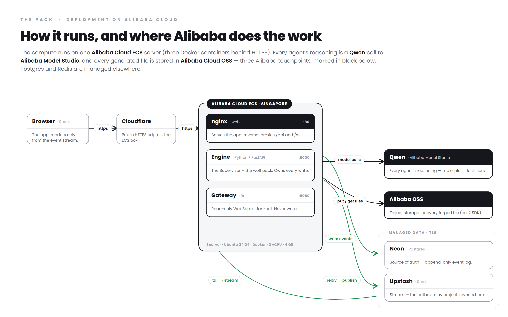

# The Pack — Architecture

The Pack is an event-sourced (CQRS) multi-agent research orchestrator with a transactional outbox.
Six diagrams tell the whole story, in one consistent style: monochrome, hairline connectors, big type,
and short asides that explain *why*, not just *what*. Solid lines are the synchronous write path;
dashed lines are the asynchronous read / projection path; an inverted (black) node is a single source
of truth. The one exception is the deployment board, where black marks the three places **Alibaba
Cloud** does the work.

The narrated walkthrough in plain words is [`The-Pack-Architecture.pdf`](The-Pack-Architecture.pdf).

## 1. Deployment — running on Alibaba Cloud
Where it actually runs. The compute is one **Alibaba Cloud ECS** server holding three Docker containers
(nginx, the Python engine, the Rust gateway) behind HTTPS. Every agent's reasoning is a **Qwen** call to
**Alibaba Model Studio**, and every generated file is stored in **Alibaba Cloud OSS** — three Alibaba
touchpoints, marked in black. Postgres (Neon) and Redis (Upstash) are managed, over TLS.

## 2. System overview
The signature loop at a glance: a command comes in, becomes exactly one validated event, one write to
Postgres (the truth); a relay projects it to Redis; the read-only Rust gateway fans it back over
WebSocket; the browser rebuilds all state from the event stream. Follow the numbers, down and back up.

## 3. Backend & gateway detail
Every layer as real modules: the FastAPI API surface, the engine (Supervisor, strategies, the wolf pack
— Alpha, Beta, Scouts, Tracker, Sentinel, Howler, Elder, Warden — plus Boundary, Emitter, Forge, and the
tools), the providers it calls out to (Qwen, and DuckDuckGo + Jina readers for the web), persistence,
and the async projection / read path.

## 4. Frontend module map
React 18 + Vite SPA: entry and providers, then routing, then the feature modules (organised by feature,
not file type), then the three shared layers they draw on (state, UI, data access), then the seam to the
backend — REST + SSE to the engine, WebSocket to the Rust gateway.

## 5. Data model (ERD)
The ten domain tables in Postgres, hub-and-spoke around `hunts`. `events.(hunt_id, seq)` is the
append-only spine (the composite key the database enforces); `hunts.parent_hunt_id` threads follow-up
hunts to their origin; `documents` and `instincts` stand on their own; `memory` is a soft link (no FK)
so a lesson survives its hunt.

## 6. One hunt, start to finish (sequence)
A hunt end to end: create, subscribe, the projection loop, plan (`plan_proposed`), approve, run the pack
(`wolf_spawned` → `tool_called`/`tool_result` → `artifact_created` → `hunt_completed`), then the final
artifact — plus the SSE chat side-channel that streams straight from the engine and skips the gateway.

