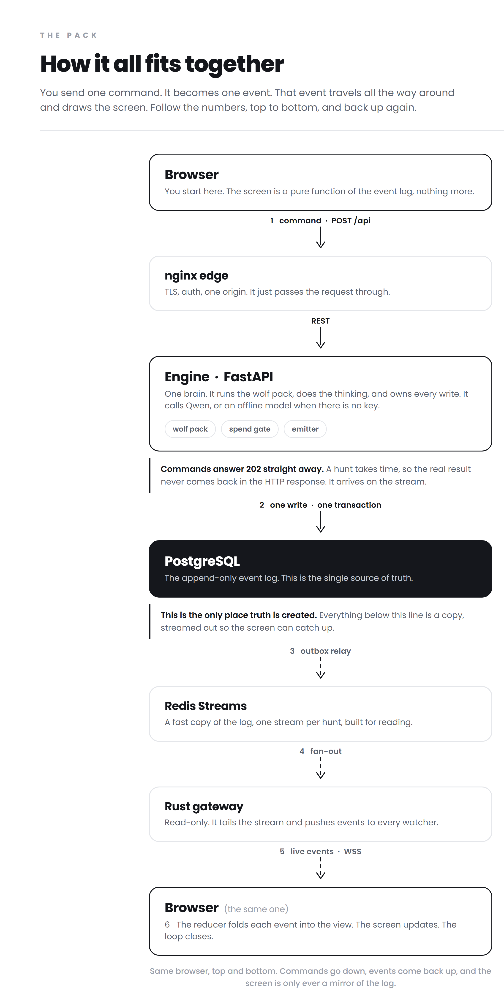
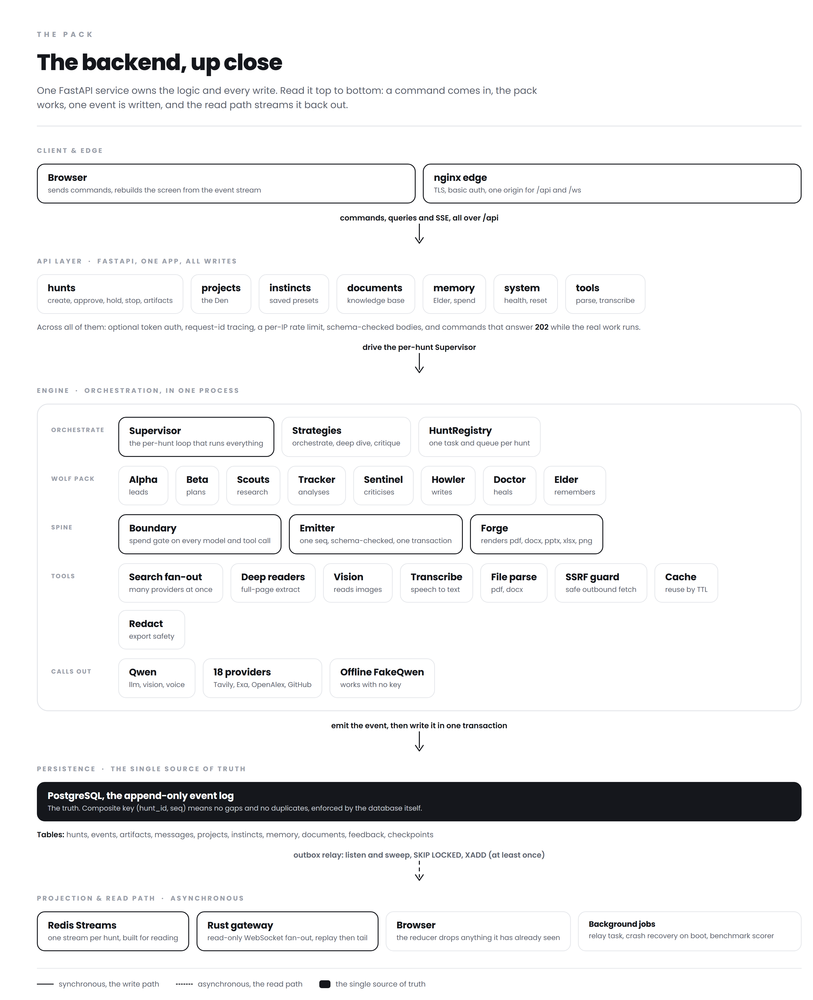
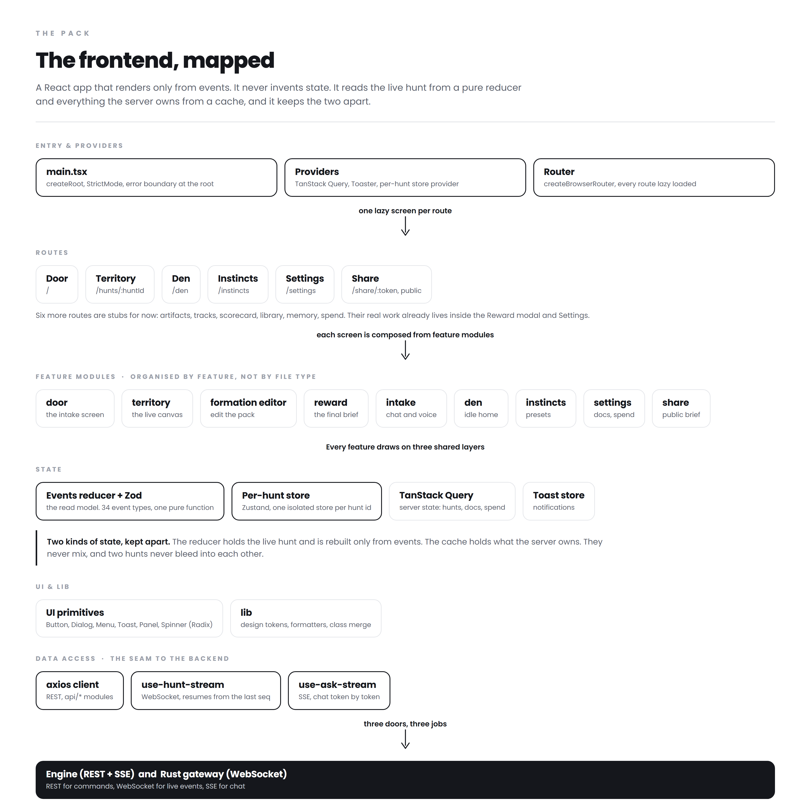
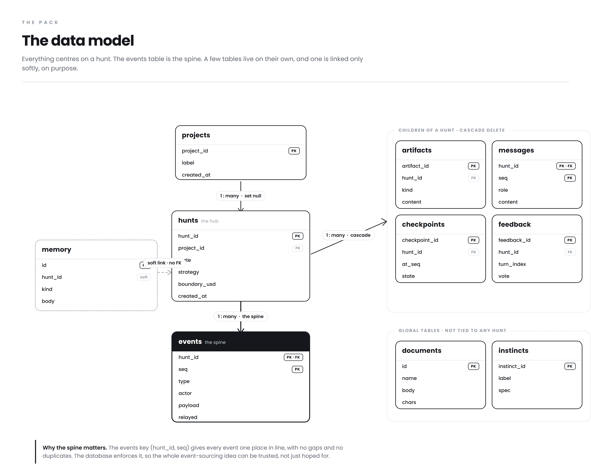
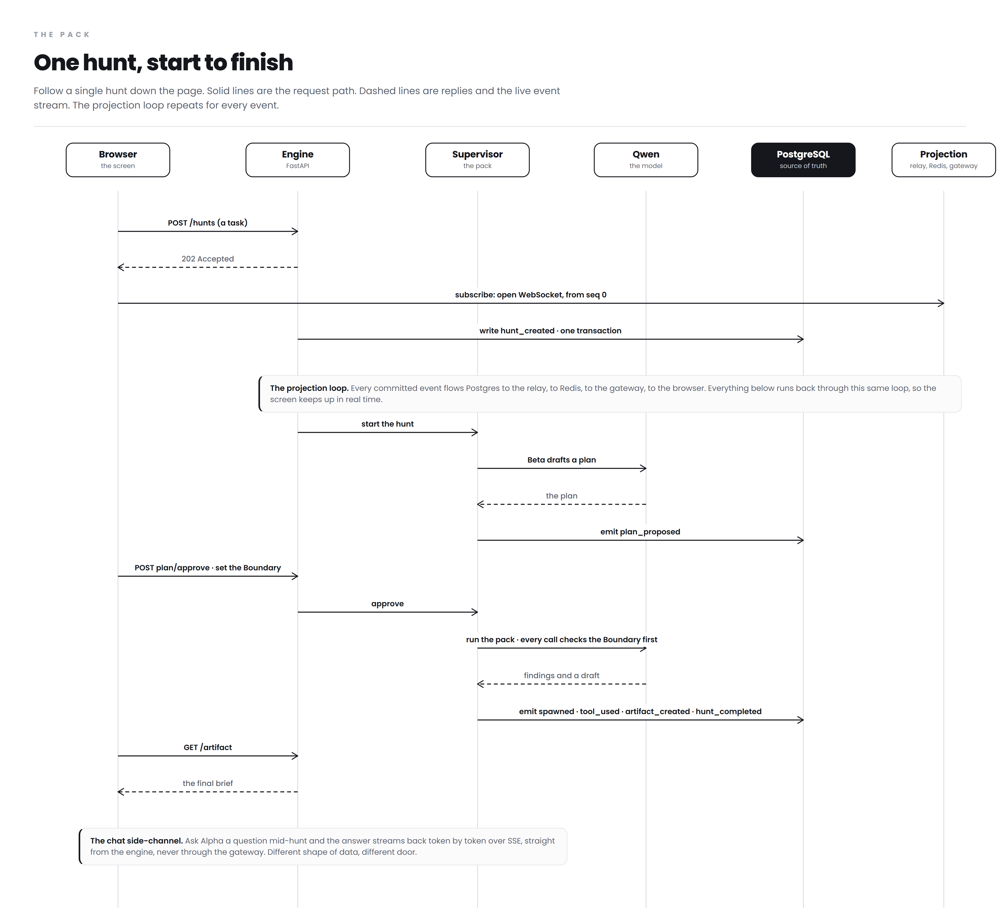

# The Pack — Architecture diagrams

A visual pack for the whole system: an event-sourced (CQRS) multi-agent orchestrator with a
transactional outbox. One consistent style across every board: monochrome, hairline connectors,
big type, and short asides that explain *why*, not just *what*. Solid lines are the synchronous
write path; dashed lines are the asynchronous read / projection path; the inverted (black) node is
the single source of truth.

Each diagram is a high-resolution PNG rendered from a self-contained HTML source in
[`diagram-src/`](diagram-src/) (edit the `.html`, re-render, see below). The narrated walkthrough of
all five, in plain words, is [`The-Pack-Architecture.pdf`](The-Pack-Architecture.pdf).

## 1. System overview
The signature loop at a glance: a command comes in, becomes one validated event, one write to
Postgres (the truth); a relay projects it to Redis; the read-only Rust gateway fans it back over
WebSocket; the browser rebuilds all state from the event stream. Follow the numbers, down and back up.



## 2. Backend & gateway detail
Every layer as real modules: the FastAPI API surface, the engine (Supervisor, strategies, the wolf
pack, Boundary, Emitter, Forge, tools), external providers, persistence, and the async projection /
read path.



## 3. Frontend module map
React 18 + Vite SPA: entry and providers, then routing, then feature modules, then the three shared
layers they draw on (state, UI, data access), then the seam to the backend.



## 4. Data model (ERD)
The ten domain tables in Postgres, hub-and-spoke around `hunts`. `events.(hunt_id, seq)` is the
append-only spine; `documents` and `instincts` stand on their own; `memory` is a soft link (no FK).



## 5. One hunt, start to finish (sequence)
A hunt end to end: create, subscribe, the projection loop, plan, approve, run the pack, final
artifact, plus the SSE chat side-channel that streams straight from the engine and skips the gateway.



---

### Regenerating a diagram
Every PNG is rendered from its HTML source in `diagram-src/` with headless Chrome. No build step and
no network: Poppins is bundled in `diagram-src/fonts/`, and the sources are pure HTML and CSS (the
sequence board builds its arrows from a small inline script).

```bash
# 1. render tall, then 2. crop to content with the included helper
chrome --headless=new --hide-scrollbars --force-device-scale-factor=2.5 \
  --screenshot=raw.png --window-size=1500,2400 "file:///abs/path/diagram-src/d_backend.html"
pwsh diagram-src/crop.ps1 -in raw.png -out backend.png -margin 52
```

Sources: `d_overview.html` → `pack-architecture.png`, `d_backend.html` → `backend.png`,
`d_frontend.html` → `frontend.png`, `d_erd.html` → `erd.png`, `d_sequence.html` → `sequence.png`.
Tune `--window-size` to the board and `--force-device-scale-factor` for resolution (3 is sharpest).
